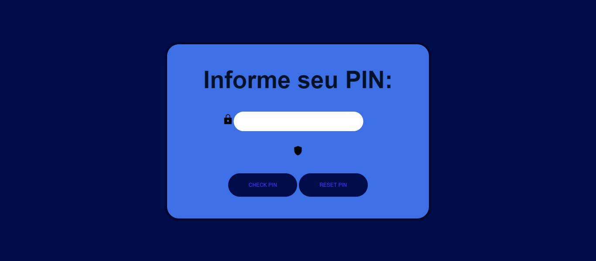
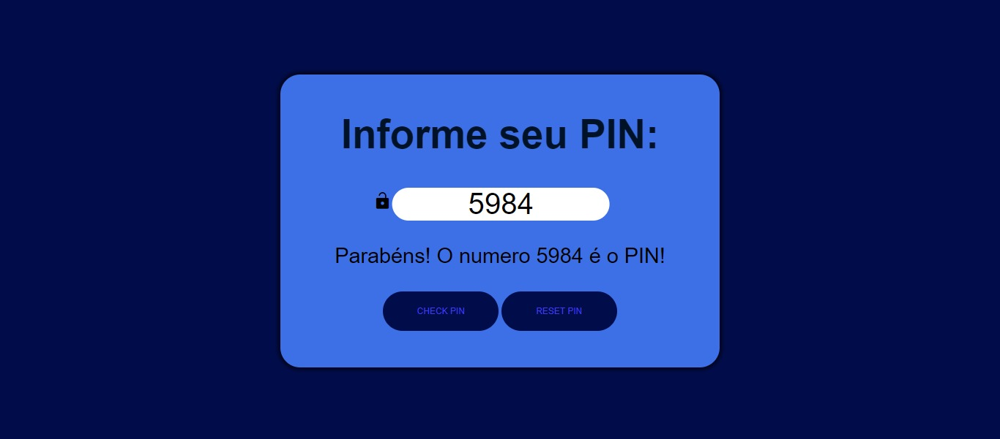
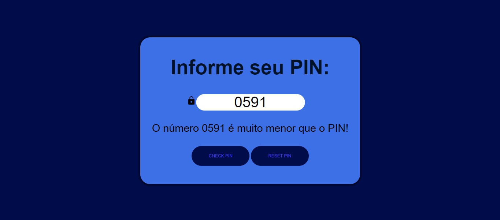
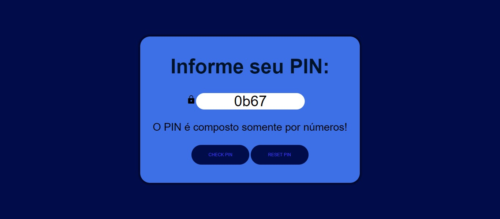

# Projeto: Verificação de PIN

## Descrição

Este projeto tem como finalidade verificar um PIN de 4 dígitos gerado randomicamente de 0000 a 9999, onde é passado dicas se o número colocado pelo usuário está maior ou menor do que o número gerado. Dessa forma o usuário pode prosseguir até atingir o número correto, recebe uma mensagem informando que atingiu o número com êxito ou reiniciar o sistema para fazer uma nova tentativa. Com propósito de ser um site de design simples e intuitivo e uma paleta monocromática Azul.

 

## Funcionalidades:

- Gerar um PIN randômico entre 0000 e 9999.
- Receber as tentativas do usuário.
- Validar as entradas do usuário se são números PIN válidos.
- Informar a proximidade do PIN gerado, se é muito maior, maior, muito menor, menor ou se acertou.
- Resetar o site, gerando um novo número PIN randômico.

## Tecnologias Utilizadas:

- JavaScript
- HTML5
- CSS3

## Como utilizar o Sistema

1. Faça um clone deste repositório remoto para o seu repositório local.
2. Acesse o index.html, através da pasta do projeto.
3. Ao acessar o site já é gerado o PIN randômico.
4. Faça as tentativas de PIN, após colocar os números, somente pressionar CHECK PIN.
5. Durante tentativas, enquanto não acertar o PIN, será gerado mensagens indicando se o número é maior ou menor.
6. Tente números de 4 dígitos seguindo as dicas até acertar!
7. Caso tenha acertado ou deseje tentar com outro PIN, somente apertar no botão de RESET PIN.

## Dificuldades conhecidas

### Validações:

- Garantir que seria contabilizado somente números PINs válidos, com 4 dígitos númericos.
- Diversos tipos de validações por exemplo, digitar diferentes tipos de caracteres que não sejam números, bloquear sinalizadores de números hexadecimais (0x), números em octal (0o) e números binários (0b), números com sinais e outras.

## Considerações finais

Este projeto foi bastante importante para adquirir diversos tipos de conhecimento e para lapidar o entendimento e conhecimento das tecnologias e dos conceitos utilizados. A execução desse sistema foi seguin solicitações da avaliação da primeira sprint do programa de bolsas Compass UOL para formação em machine learning para AWS. 